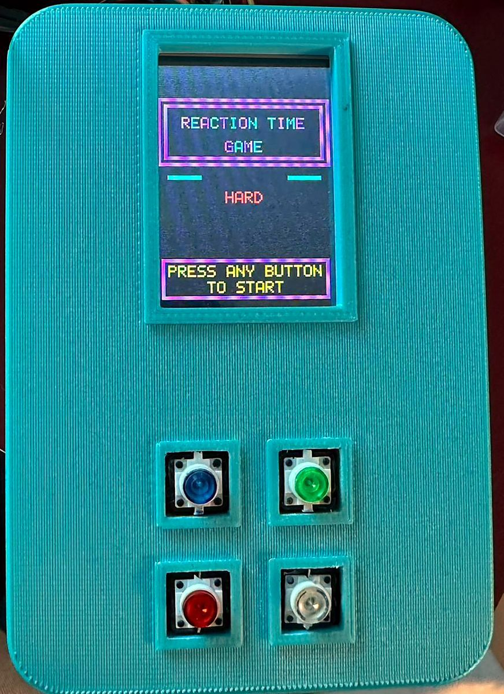
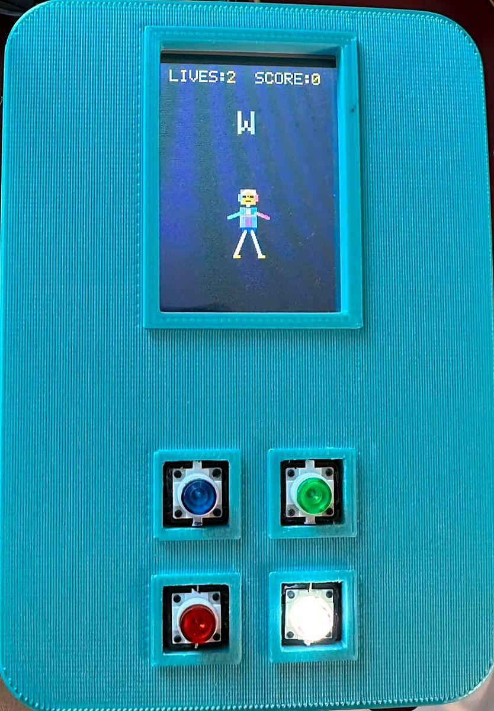
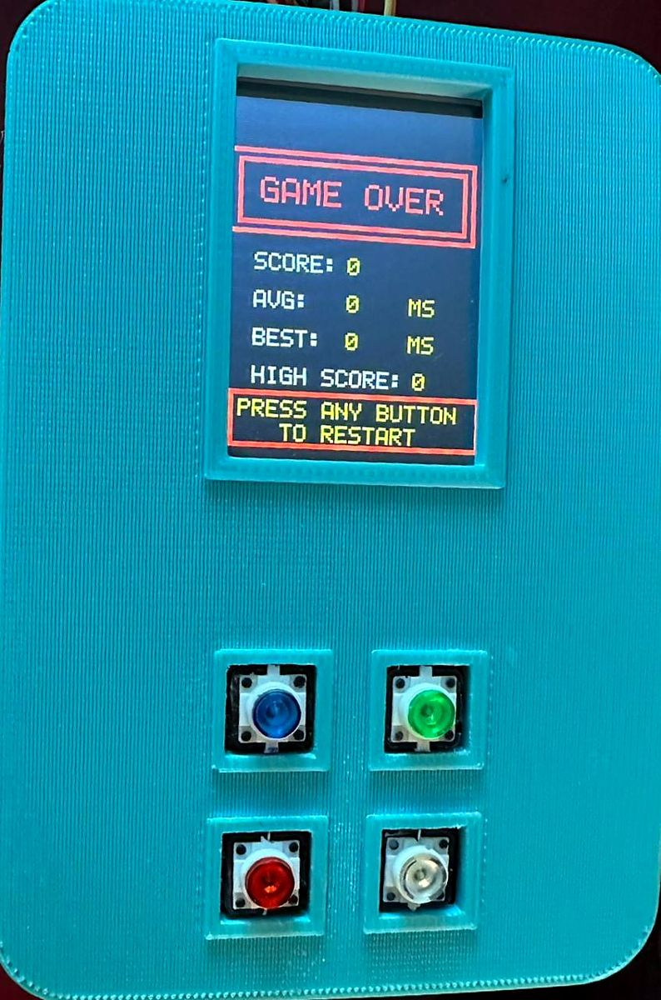
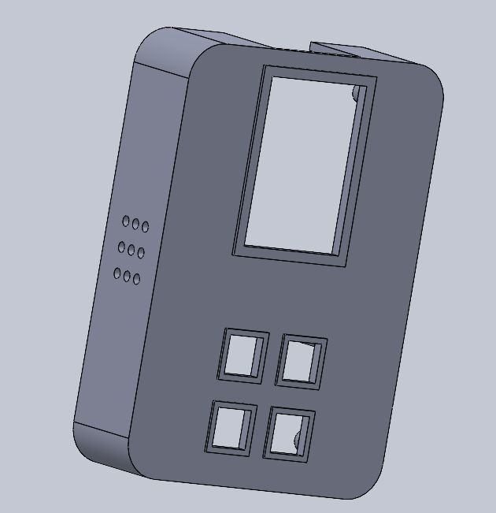

# Reaction-Time Dance Console

A handheld arcade game built on a PSoC 5LP microcontroller. One of four LED buttons lights up: press it before time runs out and a pixel dancer on the color TFT screen strikes that button's pose.

| Start screen | Gameplay | Results |
|:---:|:---:|:---:|
|  |  |  |

## How it plays

- A random button lights up and its letter appears on screen.
- Press it within the response window to score. The dancer takes that button's pose and a matching tone plays.
- A wrong press or a miss costs one of three lives. Every ten correct presses earns a bonus life.
- The game-over screen shows the score, average and best reaction time, and the high score.
- A knob selects the mode:

| Mode | Response window |
|---|---|
| Easy | 1.8 s |
| Medium | 0.9 s |
| Hard | 0.3 s |
| Freestyle | No timer: each button holds a tone and moves the dancer directly |

## Highlights

- **Display driver written from scratch.** SPI command and data framing, RGB565 color, address windows and a 5×7 bitmap font for the ILI9341.
- **Partial redraws.** Only the score, lives, cue, message and dancer are redrawn, never the full 240×320 screen.
- **Sprite rendering.** The dancer is drawn off-screen into a 64×96 buffer with rectangles and Bresenham lines, then sent to the display in one transfer.
- **Accurate timing.** During a cue the loop only polls the buttons every 2 ms. All drawing happens before or after, so display transfers never affect the measured time.
- **Independent audio.** A 1 ms SysTick interrupt runs the background melody and button tones, so the music stays steady while the screen updates.

## Hardware

| Part | Details |
|---|---|
| Microcontroller | PSoC 5LP (CY8C5868AXI-LP035) |
| Display | ILI9341 240×320 color TFT over SPI |
| Input | 4 tactile buttons with built-in LEDs, potentiometer for mode select |
| Audio | Speaker driven by PWM through an LM386 amplifier |
| Enclosure | Designed in SolidWorks and 3D printed |

Pin map

| Signal | Pin | Signal | Pin |
|---|---|---|---|
| Button 1 (red) | P4[1] | LED 1 | P4[0] |
| Button 2 (white) | P4[3] | LED 2 | P4[2] |
| Button 3 (blue) | P4[5] | LED 3 | P4[4] |
| Button 4 (green) | P4[7] | LED 4 | P4[6] |
| TFT SCK | P2[3] | TFT MOSI | P2[4] |
| TFT MISO | P2[1] | TFT CS | P2[7] |
| TFT DC | P2[5] | TFT RESET | P2[6] |
| TFT backlight | P2[2] | Potentiometer | P6[5] |
| Audio out | P3[7] | | |

## Code layout

All source files are in [`firmware/dance_console.cydsn`](firmware/dance_console.cydsn).

| File | Purpose |
|---|---|
| `main.c` | Setup and the main game loop |
| `game.c` | Game state, LEDs, scoring, mode selection and Freestyle mode |
| `screens.c` | Start screen, game layout, score and cue updates, game-over screen |
| `dancer.c` | Dancer sprite buffer, line drawing and pose animation |
| `audio.c` | Background melody, button tones and the SysTick audio engine |
| `font.c` | 5×7 bitmap font and text drawing |
| `tft.c` | ILI9341 SPI driver and display initialization |

The hardware design (schematic and pin assignments) is in `TopDesign/TopDesign.cysch` and `dance_console.cydwr`.

## Building

1. Install [PSoC Creator](https://www.infineon.com/cms/en/design-support/tools/sdk/psoc-software/psoc-creator/) (the project was made with version 3.3; newer versions will offer to update it).
2. Open `firmware/dance_console.cywrk`.
3. Choose **Build → Build dance_console**, then **Debug → Program** with the board connected.

PSoC Creator regenerates the component source files on every build, so they are not stored in the repository.

## About

Built by Lara Monagel for MIT's Microcomputer Project Laboratory, Spring 2026.
